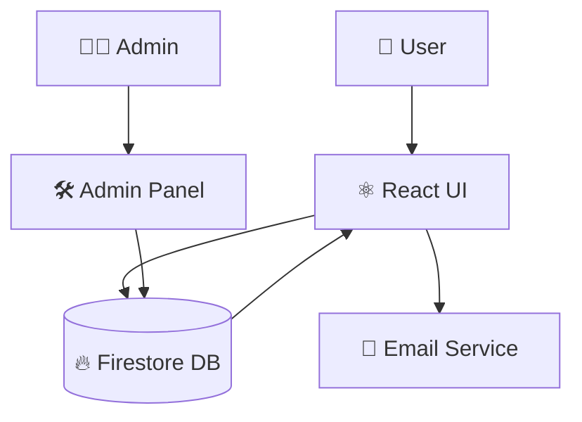

<!-- ===================== HERO SECTION ===================== -->

<div align="center">

# ✨ 🚀 It's my portfolio

<!-- AUTO TYPING HEADER -->


<br/>

🌐 **Live Demo:** [https://srinivasapallapu9.web.app](https://srinivasapallapu9.web.app)

</div>

---

<!-- ===================== BADGES ===================== -->

<div align="center">


</div>

---

## 🌌 About This Project

✨ A **next-generation portfolio system** with real-time backend control  
⚡ Built using **React + Firebase + EmailJS**  
🧠 Designed for **developers who want dynamic control without redeploying**

---

## 💎 Key Features (Glass UI Style)

- 🔥 Real-time Firebase database updates
- 🧑‍💻 Admin Dashboard (full control system)
- 🎨 Glassmorphism UI design system
- ⚡ Smooth animations & transitions
- 📱 Fully responsive (mobile-first design)
- 📩 EmailJS contact automation
- 🧠 Modular scalable architecture

---

## 🧠 Tech Stack

<div align="center">


</div>

---

## 🏗️ Architecture Flow



---

## ⚡ Admin Control System

✔ Manage Projects in real time  
✔ Edit Skills dynamically  
✔ Update Certifications instantly  
✔ No redeploy required

---

## 📁 Project Structure
/src
├── pages        → Main UI Pages

├── components   → Reusable Components

├── admin        → Admin Dashboard

├── animations   → UI Animations

└── services     → Firebase Logic
/public           → Static Assets

---

## 🚀 Installation

```bash
git clone https://github.com/your-username/portfolio.git
cd portfolio
npm install
npm start
```

---

## 🔥 Deployment

```bash
npm run build
firebase deploy
```

---

## 🌟 Highlights

- Ultra Modern Glassmorphism UI
- Real-time Firebase Backend
- Fully Dynamic Admin Dashboard
- Smooth Animated Transitions
- Production Ready Architecture

---

## 📊 GitHub Stats

<div align="center">

</div>

---

## 🌐 Connect With Me

<div align="center">

<a href="https://linkedin.com/in/srinivaspallapu9">

</a>
<a href="mailto:srinivaspallapu9381@gmail.com">

</a>
<a href="https://github.com/srinivaspallapu9">

</a>

</div>

---

## 💡 Final Touch

<div align="center">


</div>

<div align="center">

💙 Turn Your idea's Into Code | Srinivas

</div>
